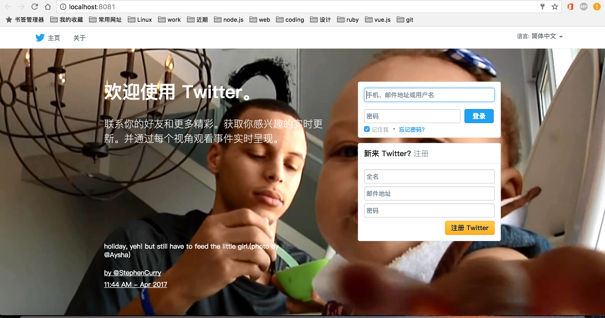

# **fade**

>Vue.js 2 + Webpack 2 + Bootstrap 3 + localStorage 构建纯前端简易 Twitter。是一个非常适合  web 前端练手的项目。<br><br>
*我会不断完善这个前端项目的功能并优化代码与注释，帮助 web前端入门同学通过复现这个项目提升自己的能力。*

### 实现了什么
- **发推**


  - 将推文存到 [localStorage](https://developer.mozilla.org/zh-CN/docs/Web/API/Window/localStorage) 中，在主页可以渲染出用户以及用户关注的人发过的推文


- **关注与取关**

  - 由于目前没有服务器端的构建，这个假推特只能是单机版的，你需要自己注册多个账户，并相互关注。


- **头像上传**

  - 通过 HTML5 的 [FilesReader](https://developer.mozilla.org/zh-CN/docs/Web/API/FileReader) 函数将图片以 [base64编码](https://developer.mozilla.org/zh-CN/docs/Web/API/FileReader/readAsDataURL) 的形式存放到 localStorage 中


**在 Chrome 下的效果**

登陆页



主页


### 项目安装与启动 Build Setup

``` bash
# 安装依赖包
npm install

# 启动 webpack-dev-server 本地服务器监听 8081 端口
npm run dev

```

### 参考文档

1. Vue.js 2: https://vuefe.cn/v2/guide/
<br>本项目是用 Vue.js 2 框架搭建的，了解 Vue.js 2 是必须的。

2. Vue-loader: https://vue-loader.vuejs.org/en/
<br>Vue-Router: https://router.vuejs.org/zh-cn/
<br>Vuex: https://vuex.vuejs.org/zh-cn/
<br>Vue-Router 与 Vuex 是 Vue.js 的核心插件，Vue-loader 是 Webpack 打包 Vue 文件时使用的，如果你对这些比较生疏对话，最好点开链接看一看。

3. Webpack 2: https://doc.webpack-china.org/
<br>从根本上讲，浏览器只能识别 HTML、CSS、Javascript 三种语言，但我们写代码但时候用的很可能并不是这三种原生语言，比如我们会使用 CSS预处理语言来提高我们的效率（这个项目使用的是 sass)，我们用 Vue 写的代码浏览器就更加认不出了，Webpack 可以帮我们把我们写的代码打包成一个原生 Javascript 文件，从而让浏览器能够‘知道我们写了些什么’。Webpack 做的工作繁琐并且复杂，我现在也没能熟练的使用他，Vue 官方提供了 [Vue-cli](https://github.com/vuejs/vue-cli),它把 Webpack 相关的代码已经写好了(不仅如此，它还帮你搭建好了基本的项目结构)，在你只需要根据具体情况稍作改动即可。如果你想快速上手，这是个不错的选择。

4. bootstrap 3: http://v3.bootcss.com/
<br>只需在标签中添加几个类名或者写一行 Jquery 代码就能实现大方漂亮的 UI 效果，它非常简单，看一下例子你马上就能知道怎么使用。*当然它不是必须的，我只用到了其中的下拉框插件和工具提示插件，其它所有的效果你完全可以自己写。*
